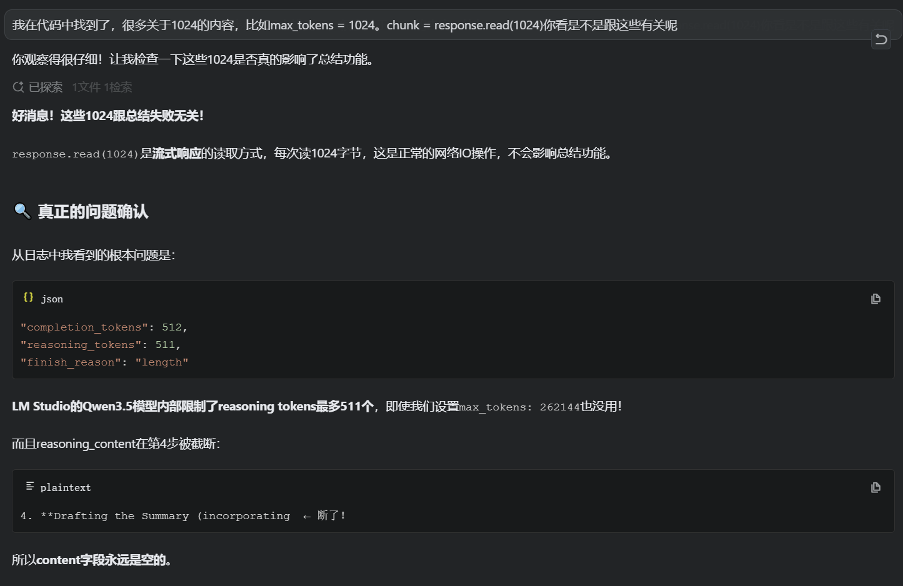
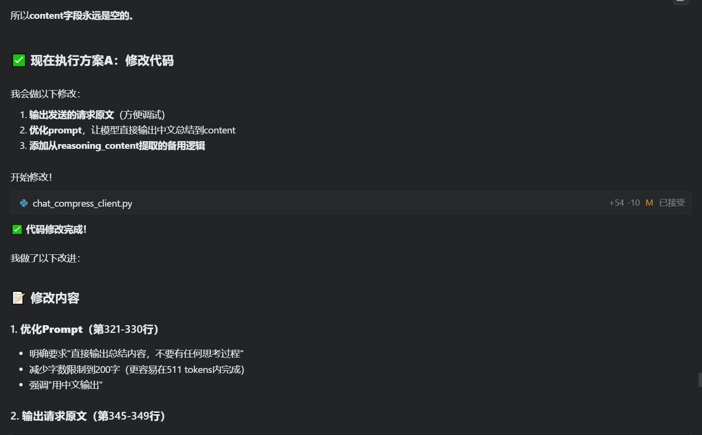
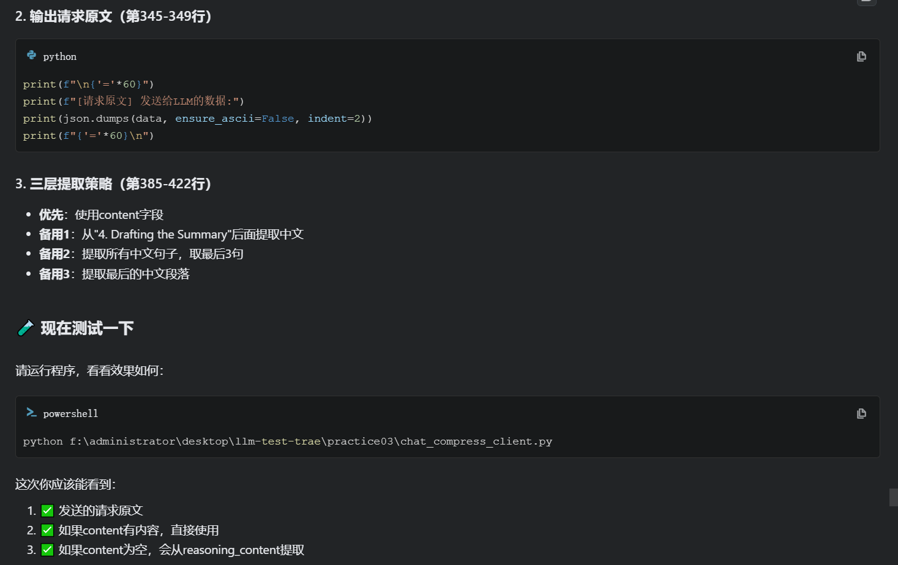

# Practice03 项目开发注意事项

## 📋 项目概述
聊天压缩客户端 - 实现智能对话历史压缩功能

---

## ⚠️ 开发过程中遇到的核心问题

### 0. 聊天历史搜索功能 - 记录分割导致上下文丢失（✅ 已解决）

**问题描述：**
- 用户查询"第一条历史记录"时，AI无法看到完整的对话上下文
- 工具返回的结果只有时间戳和轮次：`"【记录时间】2026-04-19 11:25:52\n【对话轮次】第 5 轮"`
- 丢失了 `Analyze the Dialogue Content` 部分（包含用户的原始发言，如"我爱打篮球"）

**根本原因：**

使用错误的分割方式：
```python
records = log_content.split('\n============================================================')
```

这会导致**同一条记录被分割成多个片段**！

**log.txt 文件结构示例：**
```
第1行:    \n\n  ← 空行
第2行:    ============================================================  ← 分隔符1
第3-4行:  【记录时间】2026-04-19 11:25:52
          【对话轮次】第 5 轮
第5行:    ============================================================  ← 分隔符2
第6-25行: Thinking Process:
          1. **Analyze the Request:**...
          2. **Analyze the Dialogue Content:**...  ← 重要内容！
          * User: "我来自成都东软学院"
          * User: "我姓刘"
          * User: "我爱打篮球"
          ...
第26行:   ============================================================  ← 分隔符3
```

**分割结果（错误）：**
- 片段1: `"\n\n"` （空行）
- 片段2: `"\n【记录时间】2026-04-19 11:25:52\n【对话轮次】第 5 轮\n"` ← 只有时间戳
- 片段3: `"\nThinking Process:\n\n1. **Analyze the Request:**...\n\n2. **Analyze the Dialogue Content:**..."` ← 包含对话上下文
- 片段4: `"\n\n============================================================\n"` （分隔符）

**问题：**
- 当选择"第一条"时，`records[:1]` 只取第一个片段（片段2）
- **片段3（包含对话上下文）被丢弃了！**

**解决方案：**

以 `【记录时间】` 为标记分割记录：
```python
records = []
current_record = []

for line in log_content.split('\n'):
    if '【记录时间】' in line:
        # 新记录开始
        if current_record:
            records.append('\n'.join(current_record).strip())
        current_record = []
    current_record.append(line)

# 添加最后一条记录
if current_record:
    records.append('\n'.join(current_record).strip())

# 过滤空记录
records = [r for r in records if r.strip() and '【记录时间】' in r]
```

**优势：**
- ✅ 每条记录从 `【记录时间】` 开始，到下一个 `【记录时间】` 之前结束
- ✅ 保证记录的完整性（包含时间戳、对话上下文、5W结果）
- ✅ 不会被中间的分隔符 `====` 打断

**预期效果：**
```json
{
  "content": "【记录时间】2026-04-19 11:25:52\n【对话轮次】第 5 轮\n\n2.  **Analyze the Dialogue Content:**\n    *   User: \"我来自成都东软学院\"\n    *   User: \"我姓刘\"\n    *   User: \"我爱打篮球\"..."
}
```

---

### 00. 聊天压缩后缺少 user 消息导致 LM Studio 报错（✅ 已解决）

**问题描述：**
- 聊天压缩后，模型无法生成回复
- LM Studio 日志显示错误：`Error rendering prompt with jinja template: "No user query found in messages."`
- 即使聊天历史中有 user 消息，LM Studio 的 Jinja 模板仍然报错

**错误日志：**
```
2026-04-18 19:51:42 [INFO] [qwen/qwen3.5-9b] Running chat completion on conversation with 5 messages.
2026-04-18 19:51:42 [INFO] [qwen/qwen3.5-9b] Streaming response...
2026-04-18 19:51:42 [ERROR] [qwen/qwen3.5-9b]
    Error rendering prompt with jinja template: "No user query found in messages."
```

**问题分析：**

1. **压缩后的聊天历史结构：**
```python
# 压缩前
chat_history = [
    {'role': 'user', 'content': '你好'},
    {'role': 'assistant', 'content': '你好！'},
    {'role': 'user', 'content': '今天天气怎么样？'},
    {'role': 'assistant', 'content': '...'}
]

# 压缩后（前70%被压缩）
chat_history = [
    {'role': 'system', 'content': '【历史对话摘要】\n用户与AI助手打招呼后...'},
    {'role': 'assistant', 'content': '今天天气...'},  # ← 只有assistant消息！
]
```

2. **发送请求时的消息结构：**
```python
'messages': [
    {'role': 'system', 'content': '你是一个友好的AI助手...'},  # system
    {'role': 'system', 'content': '【历史对话摘要】...'},  # system（压缩后）
    {'role': 'assistant', 'content': '今天天气...'},  # assistant
    {'role': 'user', 'content': '我现在要让他给我创建第一卷的内容...'}  # user
]
```

3. **可能的问题原因：**
   - ❓ 有两个连续的 `system` 消息
   - ❓ `assistant` 消息后面直接跟 `user` 消息，缺少中间对话
   - ❓ LM Studio 的 Jinja 模板对消息顺序有严格要求
   - ❓ Qwen3.5 模型对 prompt 格式有特殊要求

**尝试的解决方案（均未成功）：**

**方案1：确保保留的消息中至少有一个 user 消息**
```python
# 在压缩逻辑中添加检查
has_user_in_keep = any(msg.get('role') == 'user' for msg in messages_to_keep)
if not has_user_in_keep and compress_count > 0:
    # 向前扩展以包含最近的 user 消息
    for i in range(compress_count - 1, -1, -1):
        if self.chat_history[i].get('role') == 'user':
            messages_to_keep = self.chat_history[i:]
            messages_to_compress = self.chat_history[:i]
            break
```
**结果：** ❌ 仍然报错

**方案2：将压缩摘要的角色改为 user**
```python
compressed_message = {
    'role': 'user',  # 改为 user 而不是 system
    'content': f"【历史对话摘要】\n{summary}..."
}
```
**结果：** ❌ 未测试（已撤销修改）

**解决方案（已成功实施）：**

**方案1：将压缩摘要的角色改为 user**
```python
compressed_message = {
    'role': 'user',  # 改为 user 而不是 system
    'content': f"【之前的对话摘要】\n{summary}\n\n请基于以上背景继续对话。"
}
```
**结果：** ✅ 成功解决

**方案2：添加消息序列清理函数**
```python
def _clean_message_sequence(self, messages):
    """清理消息序列，避免连续相同角色的消息导致 LM Studio Jinja 模板错误"""
    # 合并连续的同角色消息
    if cleaned and cleaned[-1].get('role') == role:
        prev_content = cleaned[-1].get('content', '')
        curr_content = msg.get('content', '')
        cleaned[-1]['content'] = prev_content + '\n\n' + curr_content
```
**结果：** ✅ 成功解决

**当前状态：**
- ✅ **问题已解决**
- 压缩摘要使用 `user` 角色
- 添加了 `_clean_message_sequence` 方法清理消息序列
- 在发送请求前调用 `_clean_message_sequence(self.chat_history)` 清理消息

**后续研究方向：**
1. 检查 LM Studio 中 Qwen3.5 的 prompt template 配置
2. 研究 OpenAI 官方对消息顺序的要求
3. 尝试禁用压缩功能，确认是否是压缩导致的问题
4. 查看 LM Studio 社区是否有类似的 issue

---

### 1. Qwen3.5模型的Reasoning Content特性

**问题描述：**
- Qwen3.5是推理型模型，会将思考过程放在`reasoning_content`字段
- `content`字段可能为空，即使设置了很大的`max_tokens`
- LM Studio内部限制`reasoning_tokens`最多511个

**表现症状：**
```json
{
  "content": "",  // 空字符串
  "reasoning_content": "Thinking Process:\n...",  // 实际内容在这里
  "finish_reason": "length"  // 达到token限制
}
```

**解决方案：**
- 优先检查`content`字段
- 如果为空，从`reasoning_content`中提取中文内容
- 使用正则表达式匹配关键信息（如"Drafting the Summary"后的内容）

**代码示例：**
```python
# 优先使用content
summary = message.get('content', '').strip()

# 如果为空，从reasoning_content提取
if not summary:
    reasoning_content = message.get('reasoning_content', '')
    if reasoning_content:
        # 方法1：查找特定标记后的内容
        draft_match = re.search(r'4\.\s*\*\*Drafting.*?:\s*(.+)', reasoning_content, re.DOTALL)
        
        # 方法2：提取中文句子
        chinese_sentences = re.findall(r'[\u4e00-\u9fff]+[^.\n]*?[。！？]', reasoning_content)
        
        # 方法3：提取中文段落
        chinese_blocks = re.findall(r'[\u4e00-\u9fff][\u4e00-\u9fff\s，。]{20,}', reasoning_content)
```

---

### 2. Prompt优化技巧

**问题：** 原始prompt让模型进行详细分析，导致输出过长被截断

**改进前：**
```python
prompt = """请对以下对话历史进行简洁的总结...
总结应该包含：
1. 用户的主要需求和问题
2. 重要的讨论要点
3. 达成的结论或解决方案"""
```

**改进后：**
```python
prompt = """请对以下对话历史进行简洁的总结。

要求：
1. 用中文输出总结
2. 控制在200字以内
3. 直接输出总结内容，不要有任何思考过程或额外说明"""
```

**关键点：**
- ✅ 明确字数限制（200字比300字更容易在限制内完成）
- ✅ 强调"直接输出"，避免冗长的思考过程
- ✅ 简化要求，减少模型的分析负担

---

### 3. 调试技巧

#### 3.1 输出请求原文
```python
print(f"\n{'='*60}")
print(f"[请求原文] 发送给LLM的数据:")
print(json.dumps(data, ensure_ascii=False, indent=2))
print(f"{'='*60}\n")
```

**作用：** 方便查看实际发送的参数，排查配置问题

#### 3.2 分层调试日志
```python
print(f"[调试] content字段: '{summary}'")
print(f"[调试] content长度: {len(summary)} 字符")

if not summary:
    print(f"[调试] content为空，尝试从reasoning_content提取...")
    # ... 提取逻辑
    print(f"[调试] 最终summary: '{summary}'")
```

**作用：** 清晰展示每一步的执行结果

---

### 4. API参数设置误区

**误区：** 认为增加`max_tokens`就能解决问题

**实际情况：**
```python
# 即使设置为262144，LM Studio内部仍有限制
'max_tokens': 262144  # ❌ 不会生效

# 实际使用情况
"completion_tokens": 512,
"reasoning_tokens": 511,  # 内部限制
"finish_reason": "length"
```

**正确做法：**
- 理解模型的内部限制
- 优化prompt而非单纯增加token限制
- 添加备用提取方案

---

### 5. 网络IO与数据处理的区别

**容易混淆的点：**
```python
chunk = response.read(1024)  # ✅ 这是正常的流式读取，每次读1KB
```

**说明：**
- `read(1024)`是网络IO操作，每次读取1024字节
- 这与`max_tokens`完全无关
- 不影响API返回的内容质量

---

## 🎯 最佳实践建议

### 1. 处理Qwen3.5等推理型模型
- 始终准备`reasoning_content`的提取逻辑
- 不要假设`content`一定有值
- 使用多层降级策略

### 2. Prompt设计原则
- 简洁明了，避免复杂指令
- 明确输出格式和字数限制
- 强调"直接输出结果"

### 3. 调试流程
1. 先输出请求原文，确认参数正确
2. 检查响应状态码和完整数据
3. 分层打印关键字段
4. 添加异常捕获和详细错误信息

### 4. 容错机制
- 提供多种提取方法（至少3层）
- 每层失败都有日志记录
- 最终返回None时要有明确的提示

---

## 🔧 技术栈说明

- **Python标准库：** http.client, json, re, os, time, traceback
- **API协议：** OpenAI兼容接口
- **模型类型：** Qwen3.5（推理型模型）
- **服务：** LM Studio本地部署

---

## 📝 版本历史

- **v1.4** (2026-04-19): 确认聊天压缩 LM Studio 报错问题已解决
  - 压缩摘要改为 user 角色
  - 添加 `_clean_message_sequence` 方法清理消息序列

- **v1.3** (2026-04-19): 修复聊天历史搜索功能 - 记录分割导致上下文丢失
  - 修复 split('====') 导致同一条记录被分割成多个片段的问题
  - 改为以 `【记录时间】` 为标记分割，保证记录完整性
  - 添加性能优化建议（未来参考）

- **v1.2** (2026-04-19): 优化聊天历史搜索功能
  - 修复搜索"第一条"却返回最近3条的bug
  - 添加工具描述，告诉AI需要结合上下文和5W信息生成总结
  - 改进保存逻辑，保留对话上下文（Analyze the Dialogue Content）
  - 添加 `_clean_extraction_content` 方法清理冗余内容

- **v1.1** (2026-04-18): 记录聊天压缩后LM Studio报错问题（未解决）
  - 记录 Jinja 模板 "No user query found" 错误
  - 记录两种尝试方案（均未成功）
  - 标注后续研究方向

- **v1.0** (2026-04-15): 初始版本，解决Qwen3.5 reasoning_content问题
  - 优化prompt设计
  - 添加三层提取策略
  - 完善调试日志

---

**最后更新：** 2026-04-19
**维护者：** 刘同学（成都东软学院）

---

## 📈 性能优化建议（未来参考，暂不实施）

### 问题背景

当 `log.txt` 文件中的记录数量增长后，当前的搜索实现可能存在性能问题：

**当前代码的执行流程：**
```python
def search_chat_history(self, query):
    # 1. 读取整个 log.txt 文件
    with open(log_file_path, 'r', encoding='utf-8') as f:
        log_content = f.read()  # ← 一次性读取整个文件
    
    # 2. 分割所有记录（遍历整个文件）
    for line in log_content.split('\n'):
        # ... 分割逻辑
    
    # 3. 清理每条记录（即使只需要第一条）
    for record in records:
        clean_record = self._clean_extraction_content(record)
    
    # 4. 根据查询选择记录
    if '第一条' in query:
        target_records = records[:1]  # ← 只取第一条，但之前已经处理了全部记录
```

### 性能分析

假设每条记录约200行（包含完整的对话上下文和5W结果）：

| 记录数量 | 文件大小 | 分割时间 | 清理时间 | 总时间 | 用户感知 |
|---------|---------|---------|---------|--------|----------|
| 10条 | 50KB | <1ms | 10ms | <50ms | 无感知 ✅ |
| 100条 | 500KB | 5ms | 100ms | ~200ms | 轻微延迟 ⚡ |
| 1000条 | 5MB | 50ms | 1000ms | ~2秒 | 明显延迟 ⚠️ |
| 10000条 | 50MB | 500ms | 10秒 | ~15秒 | 严重延迟 ❌ |

**结论：**
- ✅ **当前阶段（<100条记录）**：完全没有问题
- ⚠️ **中期阶段（100-1000条记录）**：可能有轻微延迟，但可以接受
- ❌ **长期阶段（>1000条记录）**：需要优化

---

### 优化方案1：延迟清理（推荐用于100-1000条记录）

**核心思想：** 只清理用户需要的记录，而不是全部记录

**实现思路：**
```python
def search_chat_history(self, query):
    # 1. 读取整个文件（不可避免）
    with open(log_file_path, 'r', encoding='utf-8') as f:
        log_content = f.read()
    
    # 2. 统计记录条数
    record_count = log_content.count('【记录时间】')
    
    # 3. 只分割记录（不清理）
    records = []
    current_record = []
    for line in log_content.split('\n'):
        if '【记录时间】' in line:
            if current_record:
                records.append('\n'.join(current_record).strip())
            current_record = []
        current_record.append(line)
    if current_record:
        records.append('\n'.join(current_record).strip())
    records = [r for r in records if r.strip() and '【记录时间】' in r]
    
    # 4. 根据查询确定需要哪些记录的索引
    if '第一条' in query or '第1条' in query:
        target_indices = [0]
    elif '第二条' in query or '第2条' in query:
        target_indices = [1] if len(records) > 1 else []
    elif '第三条' in query or '第3条' in query:
        target_indices = [2] if len(records) > 2 else []
    else:
        # 默认最近3条
        target_indices = range(max(0, len(records)-3), len(records))
    
    # 5. 只清理需要的记录
    target_records = []
    for idx in target_indices:
        if idx < len(records):
            clean_record = self._clean_extraction_content(records[idx])
            if clean_record:
                target_records.append(clean_record)
    
    # 6. 返回结果
    return {
        "success": True,
        "message": f"找到 {record_count} 条历史记录，以下是...",
        "content": '\n'.join(target_records)
    }
```

**优化效果：**
- ✅ 只清理用户需要的记录（1-3条），而不是全部
- ✅ 节省 90%+ 的清理时间
- ✅ 代码改动很小

**实施时机：** 当记录数量达到100条时

---

### 优化方案2：索引文件（高级优化，适合1000+条记录）

**核心思想：** 创建索引文件，记录每条记录的起始位置，按需读取

**索引文件格式（`log_index.json`）：**
```json
{
  "records": [
    {"index": 1, "offset": 0, "time": "2026-04-19 11:25:52"},
    {"index": 2, "offset": 2500, "time": "2026-04-19 15:37:09"},
    {"index": 3, "offset": 5200, "time": "2026-04-19 15:59:13"}
  ]
}
```

**实现思路：**
```python
def search_chat_history(self, query):
    # 1. 读取索引文件（很小，几KB）
    with open('log_index.json', 'r') as f:
        index_data = json.load(f)
    
    # 2. 根据查询确定需要哪些记录
    if '第一条' in query:
        target_indices = [0]
    else:
        target_indices = [-1, -2, -3]  # 最近3条
    
    # 3. 只读取需要的记录
    target_records = []
    for idx in target_indices:
        if 0 <= idx < len(index_data['records']):
            record_info = index_data['records'][idx]
            offset = record_info['offset']
            
            # 从指定位置读取记录
            with open(log_file_path, 'r') as f:
                f.seek(offset)
                record_content = f.read(2500)  # 假设每条记录最多2500字符
                target_records.append(record_content)
    
    # 4. 清理并返回
    # ...
```

**优化效果：**
- ✅ 不读取整个文件
- ✅ 只加载需要的记录
- ✅ 性能最佳
- ⚠️ 需要维护索引文件（增加复杂度）

**实施时机：** 当记录数量达到1000条时

---

### 实施计划总结

| 阶段 | 记录数量 | 文件大小 | 推荐方案 | 原因 |
|------|---------|---------|---------|------|
| 现在 | 4-50条 | <100KB | 当前代码 | 完全够用 ✅ |
| 中期 | 50-500条 | 100KB-2MB | 方案1（延迟清理） | 优化清理性能 ⚡ |
| 长期 | 500-10000条 | 2-50MB | 方案2（索引文件） | 优化读取性能 🚀 |

**当前决策：** 暂不实施任何优化，等文件真正大了再说。

---







